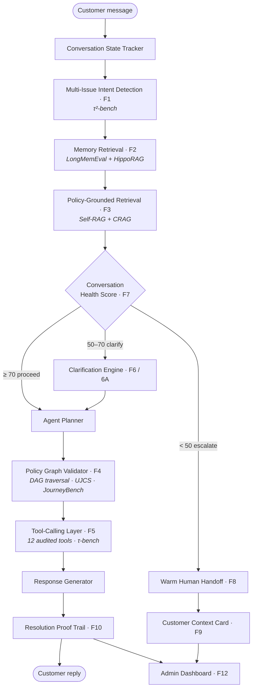

# ResolveFlow AI

**A transaction-grade customer-care agent that resolves complex issues instead of just replying to them.**

ResolveFlow AI is a production-style agentic system for telecom customer support (fictional "ConnectCare Telecom"). It detects multiple issues in one message, recalls customer history, retrieves the governing policy, validates every high-risk action against a policy graph, calls backend tools, and produces an auditable proof trail for everything it does — then escalates to a human with full context when it should.

Built for the **FlowZint AI Hackathon 2026** under the **Customer Care Bot** track.

> Most support bots answer. ResolveFlow **acts, verifies, and proves**.

---

## Why this is different

Most support bots are optimized for *conversation*, not *resolution*. They cannot remember prior history, handle multiple concurrent issues, follow business policy strictly, use backend tools reliably, decide when to clarify vs. act vs. escalate, or prove that an action was compliant. ResolveFlow closes that gap:

```
Memory + Policy RAG + Tool Calling + Clarification + Policy DAG + Handoff + Audit Trail
```

Every feature is grounded in a published research paper (τ-bench, τ²-bench, Self-RAG, CRAG, LongMemEval, HippoRAG, JourneyBench, SOP-Bench, RAGAS, and more — see [solution.txt](solution.txt) Appendix E).

---

## Architecture



The guiding principle is a **glass box**: every resolution step is inspectable — what was retrieved, which memory was used, which policy clause governed the decision, which tool was called, and whether the outcome passed evaluation. A full text version of the pipeline and the 13-table schema is in [solution.txt](solution.txt) (Appendices A & B).

---

## Tech stack

| Layer | Technology |
|---|---|
| Backend | Python 3.10+ · FastAPI · Uvicorn |
| Data | SQLite (customers, invoices, outages, tickets, credits, audit logs, …) |
| Vector store | ChromaDB (`resolveflow_policies` + customer memory) |
| LLM | Gemini (two-model split: primary for planning/response, secondary for classification) with deterministic rule-based fallbacks |
| Frontend | Next.js 16 · React 19 · Tailwind CSS · Recharts |

---

## Getting started

### Prerequisites
- **Python 3.10+**
- **Node.js 20+** (required by Next.js 16) and npm
- Git

### 1. Backend

```bash
# from the repo root
python -m venv .venv
# Windows:
.venv\Scripts\activate
# macOS/Linux:
source .venv/bin/activate

pip install -r requirements.txt

# Configure environment (optional — runs with deterministic fallbacks if omitted)
cp .env.example .env          # Windows: copy .env.example .env
# then add your GEMINI_API_KEY to .env for live LLM reasoning

# Build + seed the SQLite demo database (schema, customers, billing,
# outages, and dashboard-ready demo cases) in one command:
python -m backend.db.seed_demo_dashboard

# (Optional) index the seeded session transcripts into ChromaDB memory:
python -m backend.scripts.index_demo_data

# Run the API (http://localhost:8000, docs at /docs)
uvicorn backend.api.main:app --reload --port 8000
```

> **No Gemini key?** Everything still works — the agent falls back to deterministic
> rule-based classification, retrieval decisions, and responses (this is exactly
> what the test suite exercises).

### 2. Frontend

```bash
cd frontend
npm install
npm run dev        # http://localhost:3000
```

The dev server proxies `/api/*` to the backend at `http://localhost:8000`
(see [frontend/next.config.ts](frontend/next.config.ts); override with the
`BACKEND_URL` env var). Open **http://localhost:3000** to use the console.

### 3. Run the tests

```bash
# from the repo root, with the venv active
# macOS/Linux:
for f in scripts/test_*.py; do python -B "$f" || break; done
# Windows PowerShell:
Get-ChildItem scripts/test_*.py | ForEach-Object { python -B $_.FullName }
```

All backend features ship with a verifying test script under [`scripts/`](scripts).

---

## Evaluation

ResolveFlow uses a **three-layer evaluation methodology** (deterministic + RAGAS + human review) over 13 strict scenarios, with database-state verification, policy-gate checks, and audit assertions. See [docs/evaluation_scenarios.json](docs/evaluation_scenarios.json) and the `backend/evaluation/` package; results are also browsable on the dashboard's **Evaluation** page (`/api/evaluation/results`).

| Run | Pass Rate | Change | Notes |
| --- | ---: | --- | --- |
| v1 | 69.2% | Initial strict run | Exposed failures in angry, vague, and impatient-user cases. |
| v2 | 76.9% | DB-state verification active | Confirmed remaining failures were real agent behavior, not fake metrics. |
| v3 | 100.0% | Clarification & acknowledgment fixes | Cases 06, 07, and 11 now pass with strict checks. |

> **Note on rigor:** the evaluation runner is deterministic, so `pass@5` equals
> `pass@1` until temperature/seed variation is added. The 100% figure is across
> 13 hand-authored scenarios with real DB-state verification (not a held-out
> benchmark). Temperature variation and a larger scenario set are planned work.

Benchmark framing: deterministic ResolveFlow results are compared against published τ-bench-style SOTA (below 50% for realistic tool-use customer-service agents) in [backend/evaluation/benchmark.py](backend/evaluation/benchmark.py).

---

## Environment variables

All variables are optional (see [.env.example](.env.example)):

| Variable | Purpose | Default |
|---|---|---|
| `GEMINI_API_KEY` | Enables live Gemini reasoning (otherwise deterministic fallbacks) | _(none)_ |
| `GEMINI_MODEL` | Model used when primary/secondary aliases are unset | `gemini-2.5-flash` |
| `GEMINI_PRIMARY_MODEL` | Heavy model: planning, policy reasoning, response | `gemini-2.5-flash` |
| `GEMINI_SECONDARY_MODEL` | Light model: classification, sentiment, scoring | `gemini-2.5-flash-lite` |
| `RESOLVEFLOW_NOW` | ISO date the agent treats as "today" (the seeded world is May/June 2026) | `2026-06-01` |
| `RESOLVEFLOW_DB_PATH` | Override the SQLite database path | demo DB if present, else `data/resolveflow.db` |

---

## Project structure

```
backend/
  agent/        # intent, memory (LongMemEval+HippoRAG), policy RAG (Self-RAG/CRAG),
                # policy graph/DAG, clarification, guided action, health, handoff
  api/          # FastAPI app: tool endpoints, chat, dashboard, RAG, eval routes
  db/           # SQLite schema, seeders, reset, validation
  evaluation/   # pass^k runner, 9-metric report, RAGAS, 3-layer methodology, benchmark
  tools.py      # 12 mock tools (lookup, billing, outage, credit, ticket, handoff, audit…)
frontend/       # Next.js + Tailwind operations console (chat + reasoning panels + dashboard)
docs/           # policies, scenarios, evaluation cases, research papers
scripts/        # one test script per feature
solution.txt    # full design doc (feature→paper mapping, schema, build order, citations)
tasks.md        # build checklist
```

---

## Key features

1. **Multi-issue intent detection** — handles "charged twice + internet down + want to cancel" in one message.
2. **Customer memory layer** — three-tier memory (stable/episodic/session) with vector + graph (HippoRAG PPR) retrieval and citation-with-abstention.
3. **Policy-grounded retrieval** — Self-RAG retrieve decision + CRAG corrective routing over 8 policy docs.
4. **Policy graph / DAG** — high-risk actions are **blocked at code level** unless the prerequisite DAG nodes are visited (compliance by design, not by prompting).
5. **Tool-calling layer** — 12 SQLite-backed tools, every call logged to `audit_logs`.
6. **Clarification engine + guided action coordinator** — targeted slot questions; wait-verify loop for physical actions (router reset → re-run diagnostic, never trusts the claim).
7. **Conversation health score + relationship score** — real-time routing to clarify/escalate; cross-session trust trajectory.
8–10. **Warm handoff + customer context card + resolution proof trail** — escalate before failure with full context; UJCS-backed compliant audit log.
11. **Evaluation harness** — pass^k + 9 metrics + RAGAS + three-layer methodology + τ-bench comparison.
12. **Admin dashboard** — overview KPIs, case browser, case detail with live reasoning, evaluation page.

---

## Limitations

- Mock backend with simulated telecom data; not production-hardened (no auth, PII handling, or real payment integration).
- Evaluation is deterministic (no temperature/seed variation yet); the 100% figure is over 13 authored scenarios, not a held-out benchmark.
- In-session chat state is persisted to SQLite (`chat_session_state`) and rehydrates after a restart; it is keyed per customer rather than per concurrent session.
- The seeded world is anchored to May/June 2026 (see `RESOLVEFLOW_NOW`).

## Future work

Temperature-varied `pass@k`, larger scenario set, real CRM/payment integration, persistent multi-session storage, voice layer, and multi-language support.
