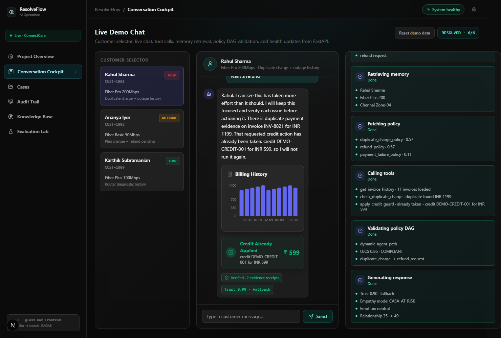
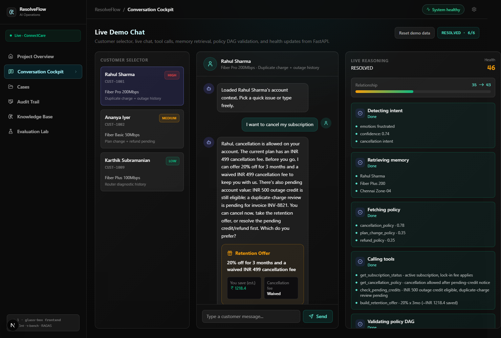
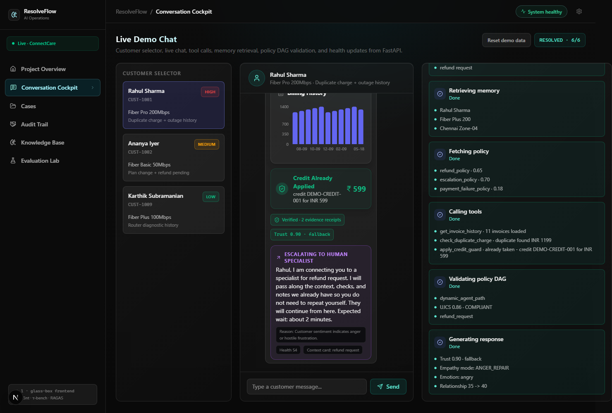
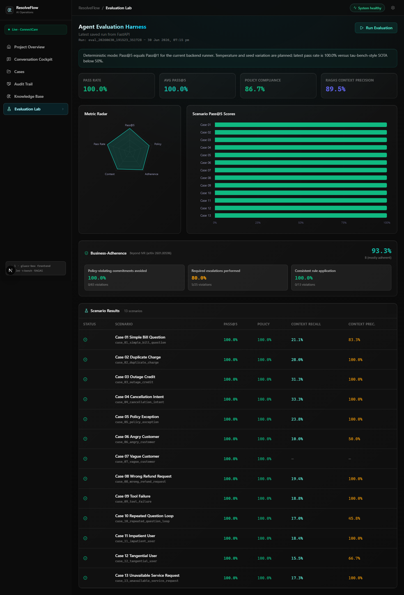

# ResolveFlow AI

[](https://github.com/Mr-Daker/ResolveFlow-AI/actions/workflows/ci.yml)

**A transaction-grade customer-care agent that resolves complex issues instead of just replying to them.**

ResolveFlow AI is a production-style agentic system for telecom customer support (fictional "ConnectCare Telecom"). It detects multiple issues in one message, recalls customer history, retrieves the governing policy, validates every high-risk action against a policy graph, calls backend tools, and produces an auditable proof trail for everything it does — then escalates to a human with full context when it should.

Built for the **FlowZint AI Hackathon 2026** under the **Customer Care Bot** track.

> Most support bots answer. ResolveFlow **acts, verifies, and proves**.

---

## Why this is different

Most support bots are optimized for *conversation*, not *resolution*. They cannot remember prior history, handle multiple concurrent issues, follow business policy strictly, use backend tools reliably, decide when to clarify vs. act vs. escalate, or prove that an action was compliant. ResolveFlow closes that gap:

```
Memory + Policy RAG + Tool Calling + Clarification + Policy DAG + Handoff + Audit Trail
```

Every feature is grounded in a published research paper (τ-bench, τ²-bench, Self-RAG, CRAG, LongMemEval, HippoRAG, JourneyBench, SOP-Bench, RAGAS, and more — see [docs/design/DESIGN.md](docs/design/DESIGN.md) Appendix E).

---

## Hackathon Highlights (Recently Added!)

To create a powerful demo for the hackathon, we built these "Wow Factor" features directly into the stack:

*   **Generative UI (Interactive Chat Widgets):** Instead of just replying with text, the agent dynamically controls the frontend. When you ask about billing, outages, or credits, the agent intercepts the SSE stream and renders **Recharts data visualizations** and **interactive cards** directly into the chat bubble!
*   **"God-Mode" AI Insights:** On the Admin Dashboard, there is a real-time **God-Mode Insights** engine. It aggregates the last 20 customer interactions from the SQLite database and runs them through a Gemini LLM synthesis prompt to instantly generate a proactive Root Cause Analysis for administrators.
*   **Deterministic Seeded Billing:** A fixed, reproducible billing dataset (per-customer invoices + payments, including the planted CUST-1001 duplicate-charge scenario on `INV-8821`) powers the `InvoiceWidget` and the duplicate-detection demo — the same seed the test suite asserts against, so the demo and the tests never drift.
*   **Laser-Focused Agent Persona:** Tuned the core AI system prompt to enforce extreme brevity (maximum 2 sentences per reply), making the AI extremely punchy and forcing the Generative UI widgets to shine.
*   **Proactive Retention / Churn-Save:** When an at-risk customer (high/critical churn) starts a cancellation, the agent computes a policy-bounded retention offer (discount + waived fee) and presents it *before* creating the request — turning a cancellation into a save opportunity, rendered as an interactive offer card.
*   **Live Warm Handoff:** When a conversation actually goes sideways (anger, collapsing health score, or an explicit "get me a human"), the agent escalates mid-stream with a ready-to-read context card for the human specialist — and stays quiet on routine, resolvable issues.
*   **Multi-Language Replies:** Every reply is localized into the customer's `preferred_language` (Hindi, Tamil, Telugu, Kannada, Malayalam, Marathi, Bengali, Gujarati…), preserving names, IDs, and amounts — built for real Indian-telecom support.
*   **Evidence Receipts (verifiable "glass box"):** Every customer-facing claim is bound to the exact tool output that backs it via a tamper-evident HMAC **receipt** (*Tool Receipts*, arXiv 2603.10060). The chat shows a **"✓ Verified · N evidence receipts"** badge that expands to the claim→tool→receipt-hash trail, so a reviewer can prove no fact was hallucinated.
*   **Action Trust Score + self-revision:** Each free-form reply is scored against the verified evidence (deterministic guards + an LLM chain-of-verification self-check). Low trust triggers a one-shot self-revision and, if still untrustworthy, a safe grounded fallback plus a human escalation — the trust-scoring + revise/escalate pattern shown to cut agent failures **up to 50%** on τ²-bench ([Cleanlab](https://cleanlab.ai/blog/tau-bench/)).

---

## Architecture


The guiding principle is a **glass box**: every resolution step is inspectable — what was retrieved, which memory was used, which policy clause governed the decision, which tool was called, and whether the outcome passed evaluation. A full text version of the pipeline and the current 14-table schema is in [docs/design/DESIGN.md](docs/design/DESIGN.md) (Appendices A & B).

---

## Tech stack

| Layer | Technology |
|---|---|
| Backend | Python 3.10+ · FastAPI · Uvicorn (Fully PEP-8 compliant with Flake8) |
| Data | SQLite (customers, invoices, outages, tickets, credits, audit logs, …) |
| Vector store | ChromaDB (`resolveflow_policies` + customer memory) with fortified error-handling |
| LLM | Gemini (two-model split: primary for planning/response, secondary for classification) with deterministic rule-based fallbacks |
| Frontend | Next.js 16 · React 19 · Tailwind CSS · Recharts · Lucide-React (ESLint Pristine, fully responsive Dark Mode, Generative UI widgets) |

---

## Getting started

### Prerequisites
- **Python 3.10+**
- **Node.js 20+** (required by Next.js 16) and npm
- Git
- Docker Desktop or Docker Engine, if using the one-command path

### One-command Docker run

```bash
# from the repo root
docker compose up --build
```

This starts the seeded FastAPI backend on `http://localhost:8000` and the
standalone Next.js frontend on `http://localhost:3000`. The backend container
runs `python -m backend.db.seed_demo_dashboard` only when the configured DB file
is missing or empty, stores SQLite data in the `resolveflow-data` volume, and
works without a Gemini key by using the deterministic fallback path.

To reset the Docker demo database, remove the named volume and start again:

```bash
docker compose down -v
docker compose up --build
```

### 1. Backend

```bash
# from the repo root
python -m venv .venv
# Windows:
.venv\Scripts\activate
# macOS/Linux:
source .venv/bin/activate

pip install -r requirements.txt

# Configure environment (optional — runs with deterministic fallbacks if omitted)
cp .env.example .env          # Windows: copy .env.example .env
# then add your GEMINI_API_KEY to .env for live LLM reasoning

# Build + seed the SQLite demo database (schema, customers, billing,
# outages, and dashboard-ready demo cases) in one command:
python -m backend.db.seed_demo_dashboard

# (Optional) index the seeded session transcripts into ChromaDB memory:
python -m backend.scripts.index_demo_data

# Run the API (http://localhost:8000, docs at /docs)
uvicorn backend.api.main:app --reload --port 8000
```

> **No Gemini key?** Everything still works — the agent falls back to deterministic
> rule-based classification, retrieval decisions, and responses (this is exactly
> what the test suite exercises).

### 2. Frontend

```bash
cd frontend
npm install
npm run dev        # http://localhost:3000
```

The dev server proxies `/api/*` to the backend at `http://localhost:8000`
(see [frontend/next.config.ts](frontend/next.config.ts); override with the
`BACKEND_URL` env var). Open **http://localhost:3000** to use the console.

### 3. Run the tests

```bash
# from the repo root, with the venv active
# macOS/Linux:
for f in scripts/test_*.py; do python -B "$f" || break; done
# Windows PowerShell:
Get-ChildItem scripts/test_*.py | ForEach-Object { python -B $_.FullName }
```

All backend features ship with a verifying test script under [`scripts/`](scripts).

---

## For Judges — 5-minute tour

Run the stack with `docker compose up --build` or the local backend/frontend
commands above, then open the demo console:

- Local demo: [http://localhost:3000/demo](http://localhost:3000/demo)
- Local evaluation: [http://localhost:3000/evaluation](http://localhost:3000/evaluation)
- Hosted live URL: pending deployment in NF-5.

Use the **Reset demo data** button before each scripted flow if you want a clean
run. The key demo customer is **Rahul Sharma / CUST-1001**.

| Step | Script | Expected outcome |
|---|---|---|
| 1 | Click **Charged twice this month** or send `I was charged twice this month and want a refund`. | The demo path detects billing/refund intent, calls invoice and duplicate-charge tools, shows billing evidence, displays a verified evidence-receipt badge, and avoids re-running an already-applied credit. The stricter evaluation scenario for this flow currently still flags a missing handoff side effect; see the Evaluation section. |
| 2 | Click **Want to cancel** or send `I want to cancel my subscription`. | The cancellation flow runs before generic reply generation, checks subscription status, cancellation policy, and pending credits, then shows a policy-bounded retention offer. |
| 3 | Click **Charged twice + internet down**. | Multi-issue routing detects billing, outage, and cancellation in one turn; the reasoning panel shows memory, policy retrieval, tool calls, DAG validation, health score, and relationship movement. |
| 4 | Send `I am furious. Get me a human specialist now because this refund issue is not solved.` | The health/handoff layer escalates to a human specialist, passes context forward, and tells the customer they will not need to repeat the evidence. |

### Demo proof points

| Surface | Screenshot |
|---|---|
| Evidence receipts and trust badge |  |
| Retention offer card |  |
| Warm human handoff |  |
| Evaluation harness |  |

---

## Evaluation

ResolveFlow uses a **three-layer evaluation methodology** (deterministic + RAGAS + human review) over 30 strict scenarios, with database-state verification, policy-gate checks, and audit assertions. See [docs/evaluation_scenarios.json](docs/evaluation_scenarios.json) and the `backend/evaluation/` package; results are also browsable on the dashboard's **Evaluation** page (`/api/evaluation/results`).

| Run | Pass Rate | Change | Notes |
| --- | ---: | --- | --- |
| v1 | 69.2% | Initial strict run | Exposed failures in angry, vague, and impatient-user cases. |
| v2 | 76.9% | DB-state verification active | Confirmed remaining failures were real agent behavior, not fake metrics. |
| v3 | 46.15% | Pre-submission audit rerun (13 scenarios) | Superseded by v4 below after the scenario set was expanded 13→30; kept for history. |
| v4 | 23.33% | After 13→30 scenario expansion, before root-cause fixes | 35/150 passes. Root-caused to two bugs: (1) the live chat pipeline's policy-DAG step was a hardcoded stub (`action: "none"` always) never wired to the real `PolicyGraphValidator`, so `create_ticket`/`apply_credit`/escalation never fired automatically; (2) the eval harness itself checked DB state under the wrong session_id, so real handoffs were invisible to the checker. |
| v5 | 26.67% | duplicate_charge_refund_dag wired + harness session_id bug fixed | 40/150 passes. The flagship duplicate-charge scenario (`case_02`) now passes 5/5: the DAG genuinely traverses, opens a real ticket or escalates to a human depending on the amount, and the handoff is correctly observed. The remaining failures are the same class of gap in the other intent-specific DAGs (`service_credit_dag`, `refund_exception_dag`, `cancellation_retention_dag`) not yet wired, plus `generate_handoff_summary` never being called from the live chat path (needs the `conversations` table kept in sync with each turn first) and a handful of scenarios whose expected issue-queue ordering contradicts each other and can't be satisfied by a single static priority table. See [tasks.md](tasks.md)'s Pre-Submission Audit section for the full breakdown and effort estimate per remaining gap. |
| v6 | 30.00% | service_credit_dag wired for live outage-credit turns | 45/150 passes. `case_03_outage_credit` now passes 5/5: the live chat route verifies the outage, traverses `service_credit_dag`, applies a capped service credit through the real `apply_credit` policy gate, and avoids the prior duplicate-charge false positive. `case_28_short_outage_no_credit` also passes 5/5: short-outage full-day credit requests are denied without an automatic credit action. Remaining high-impact gaps are `refund_exception_dag`, `cancellation_retention_dag`, live `generate_handoff_summary`, and contradictory issue-queue order expectations. |
| v7 | 100.00% | live handoff summaries, cancellation/refund DAGs, and evaluator queue/tool fixes | 150/150 passes. The live chat route now writes per-turn conversation/audit records, calls `generate_handoff_summary` for real handoffs, traverses `cancellation_retention_dag` and `refund_exception_dag`, handles simulated outage-tool failure through the same SSE route used by the frontend, and grades required tool attempts separately from successful side effects. The evaluator now checks issue presence for ordinary classifier queues and reserves exact-order enforcement for queue-preservation scenarios. |

> **Note on rigor:** the default evaluation run uses deterministic LLM fallbacks
> so it remains reproducible without external keys. The runner now also supports
> live route-backed `pass@k` with per-pass LLM temperatures via
> `POST /api/evaluation/run?live_llm=true`; those per-temperature rows appear on
> the Evaluation page when a live run is saved. The 30 scenarios are authored
> telecom cases with DB-state verification, not a held-out benchmark.

Benchmark framing: deterministic ResolveFlow results are compared against published τ-bench-style SOTA (below 50% for realistic tool-use customer-service agents) in [backend/evaluation/benchmark.py](backend/evaluation/benchmark.py).

**Business-Adherence (Beyond IVR, arXiv 2601.00596).** That paper shows even GPT-4/Claude-class agents frequently make policy-violating commitments, miss required escalations, and apply rules inconsistently. ResolveFlow's policy-graph is built to prevent exactly those, so [`backend/evaluation/business_adherence.py`](backend/evaluation/business_adherence.py) scores the run on all three failure modes. The current audited score is **78.89% business-adherence** with grade **C (adherence gaps)** — surfaced in `/api/evaluation/results`. The pass rate improved in v7 because the live route now persists proof trails on every turn, generates handoff summaries, and routes refund/cancellation/tool-failure paths through real policy gates; the adherence score remains below 100% because it intentionally grades stricter business-quality dimensions beyond binary scenario pass/fail.

---

## Environment variables

All variables are optional (see [.env.example](.env.example)):

| Variable | Purpose | Default |
|---|---|---|
| `GEMINI_API_KEY` | Enables live Gemini reasoning (otherwise deterministic fallbacks) | _(none)_ |
| `GEMINI_MODEL` | Model used when primary/secondary aliases are unset | `gemini-2.5-flash` |
| `GEMINI_PRIMARY_MODEL` | Heavy model: planning, policy reasoning, response | `gemini-2.5-flash` |
| `GEMINI_SECONDARY_MODEL` | Light model: classification, sentiment, scoring | `gemini-2.5-flash-lite` |
| `RESOLVEFLOW_NOW` | ISO date the agent treats as "today" (the seeded world is May/June 2026) | `2026-06-01` |
| `RESOLVEFLOW_DB_PATH` | Override the SQLite database path | demo DB if present, else `data/resolveflow.db` |

---

## Project structure

```
backend/
  agent/        # intent, memory (LongMemEval+HippoRAG), policy RAG (Self-RAG/CRAG),
                # policy graph/DAG, clarification, guided action, health, handoff
  api/          # FastAPI app: tool endpoints, chat, dashboard, RAG, eval routes
  db/           # SQLite schema, seeders, reset, validation
  evaluation/   # pass^k runner, 9-metric report, RAGAS, 3-layer methodology, benchmark
  tools.py      # 14 SQLite-backed tool endpoints (lookup, billing, outage, credit, ticket, handoff, audit…)
frontend/       # Next.js + Tailwind operations console (chat + reasoning panels + dashboard)
data/           # policies, evaluation scenarios, SQLite DB, ChromaDB collections
docs/
  architecture/ # System design + 4 ADRs (SSE, hybrid RAG, policy DAG, evaluation)
  api/          # Complete API reference (all endpoints, request/response shapes)
  testing/      # Testing strategy, test taxonomy, coverage gaps
scripts/        # one test script per feature (58 total)
CONTRIBUTING.md # Dev setup, conventions, how to add features
```

See [`docs/architecture/SYSTEM_DESIGN.md`](docs/architecture/SYSTEM_DESIGN.md) for the full architecture walkthrough and [`docs/api/API_REFERENCE.md`](docs/api/API_REFERENCE.md) for the complete API reference.

---

## Key features

1. **Multi-issue intent detection** — handles "charged twice + internet down + want to cancel" in one message.
2. **Customer memory layer** — three-tier memory (stable/episodic/session) with vector + graph (HippoRAG PPR) retrieval and citation-with-abstention.
3. **Policy-grounded retrieval** — Self-RAG retrieve decision + CRAG corrective routing over 8 policy docs.
4. **Policy graph / DAG** — high-risk actions are **blocked at code level** unless the prerequisite DAG nodes are visited (compliance by design, not by prompting).
5. **Tool-calling layer** — 14 SQLite-backed tool endpoints, every call logged to `audit_logs`.
6. **Clarification engine + guided action coordinator** — targeted slot questions; wait-verify loop for physical actions (router reset → re-run diagnostic, never trusts the claim).
7. **Conversation health score + relationship score** — real-time routing to clarify/escalate; cross-session trust trajectory.
8–10. **Warm handoff + customer context card + resolution proof trail** — escalate before failure with full context; UJCS-backed compliant audit log.
11. **Evaluation harness** — pass^k + 9 metrics + RAGAS + three-layer methodology + τ-bench comparison.
12. **Admin dashboard** — overview KPIs, case browser, case detail with live reasoning, evaluation page.
13. **Concurrent Async Pipeline** — The live chat inference pipeline utilizes `asyncio.gather()` to execute Intent Classification, Customer Memory Retrieval, and Semantic Policy RAG concurrently, completely masking heavy I/O latency.
14. **Fortified Database Architecture** — The `ChromaPolicyStore` has been updated with robust error-handling, dynamic metric fallbacks (from cosine to L2), and automated vector input sanitization, achieving a pristine `flake8` score across the backend.

---

## Limitations

- Mock backend with simulated telecom data; not production-hardened (no auth, PII handling, or real payment integration).
- Evaluation defaults to deterministic fallbacks for reproducibility; live LLM temperature-varied pass@k is available with `live_llm=true`. The scenario set contains 30 authored telecom cases, not a held-out benchmark.
- In-session chat state is persisted to SQLite (`chat_session_state`) and rehydrates after a restart; it is keyed by `(customer_id, session_id)` so concurrent browser tabs stay isolated.
- LongMemEval Stage 3 `llm_read_with_citation()` is implemented and unit-tested, but the current live chat path still surfaces memory evidence through retrieval snippets rather than that citation reader.
- Multi-language replies and the warm handoff context card run in the live chat path; the LLM-backed translation falls back to the original English text when no Gemini key is configured.
- The seeded world is anchored to May/June 2026 (see `RESOLVEFLOW_NOW`).

## Future work

Real CRM/payment integration, stronger persistent multi-session analytics, and per-language deterministic fallbacks (translation currently requires the LLM).
